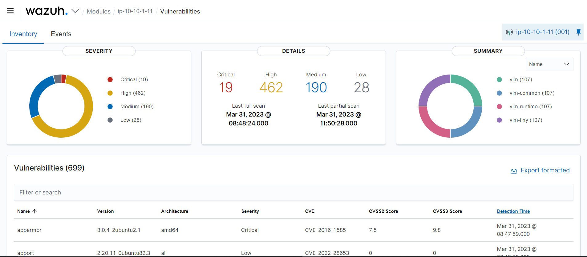
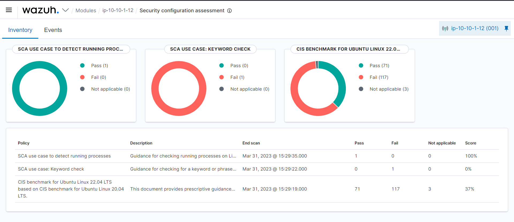
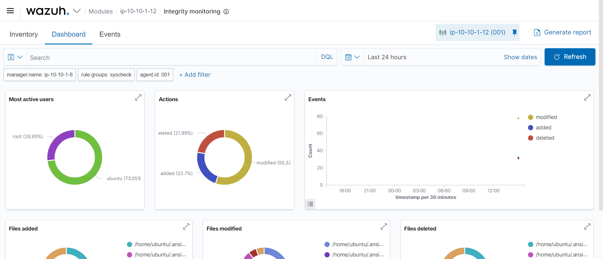
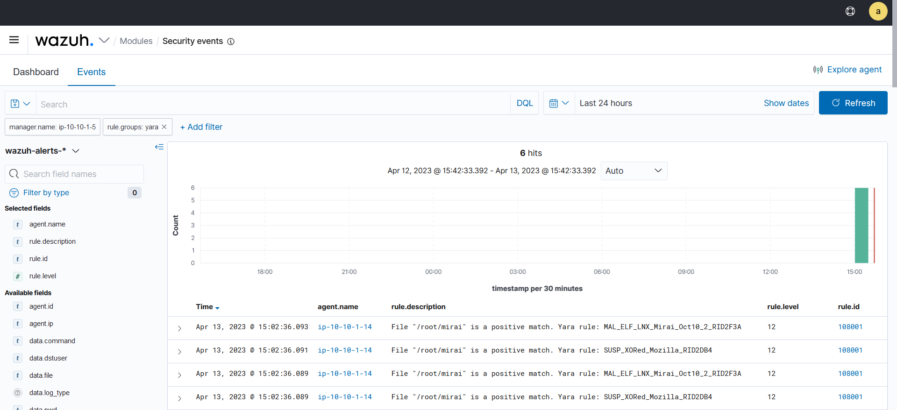
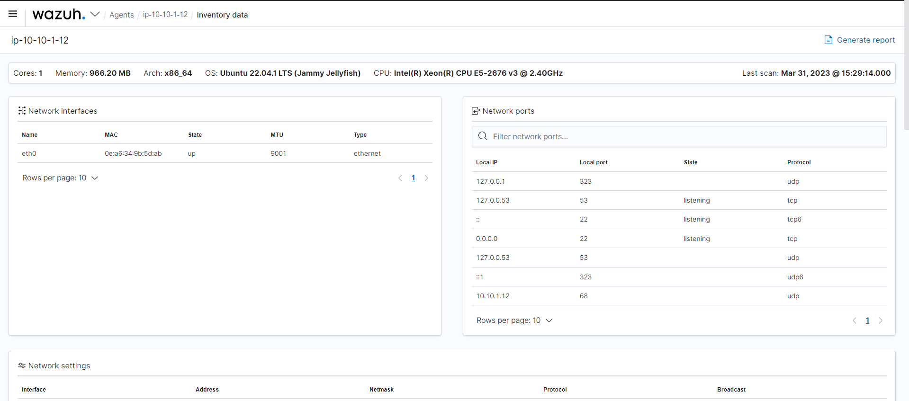
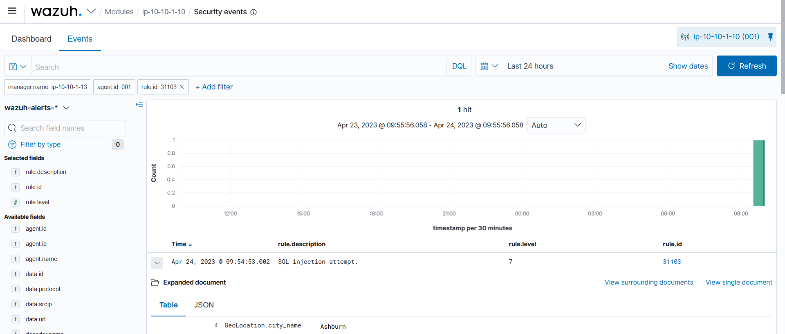

# MUST_playbooks

This repository is a modified version of the [official Wazuh-Ansible repository's playbook file](https://github.com/wazuh/wazuh-ansible/tree/master/playbooks).  
It is created to fit the needs of a SIEM solution for [MUST](https://www.must.ac.ug/).
It was installed following the [official Wazuh guide for deployment with Ansible](https://documentation.wazuh.com/current/deployment-options/deploying-with-ansible/index.html).

*This documentation assumes the reader has at least a basic understanding of Ansible and Wazuh, specifically on the syntax and function of the configurations.* 

## Table of Contents

1. [Modified files](#modified-files)
    1. [inventory](#inventory)
    2. [variables](#variables)
    3. [certificates](#certificates)
    4. [Wazuh-manager](#wazuh-manager)
    5. [Wazuh-agents](#wazuh-agents)
    6. [Wazuh extended capabilities](#wazuh-extended-capabilities)
    7. [Backup and recovery](#backup-and-recovery)
2. [Commands](#commands)
    1. [Initialize](#initialize)
    2. [Generate certificats](#generate-certificates)
    3. [Test configuration](#test-configuration)
    4. [Execute playbooks](#execute-playbooks)

## Modified files

This section details the files and folders that differ from the [original repo](https://github.com/wazuh/wazuh-ansible) and describes their (intended) function. The playbooks in this folder are specifically created to function in the server environment of MUST.

### inventory

> Ansible automates tasks on managed nodes or “hosts” in your infrastructure, using a list or group of lists known as inventory. You can pass host names at the command line, but most Ansible users create inventory files. Your inventory defines the managed nodes you automate, with groups so you can run automation tasks on multiple hosts at the same time. Once your inventory is defined, you use patterns to select the hosts or groups you want Ansible to run against. ([Ansible documentation](https://docs.ansible.com/ansible/latest/inventory_guide/intro_inventory.html))

The [inventory file](./inventory) is used by the [commands](#commands) in this repository to reference the addresses and groups used. It is configured in three "parts". 

First, variables are declared that reference the manager (named "stack") and the agent (named "agent"). Their public IP's (`ansible_host`), private IP's (`private_ip`) and (in the case of the indexer/manager) indexer node names (`indexer_node_name`) are referenced.

Second, these variables are added to groups, written as `[Wazuh-function]`.  These groups are later used by the playbooks to set the configuration on the Wazuh instances. This means that the scope of the variables (stack, agent, ...) is contained to this document, and they can be changed without needing to modify other documents. However, the names of the groups are referenced in other documents and should not be changed lightly!

Lastly, `[all:vars]` sets global variables for all the groups. These can be overwritten if needed. For the scope of this repository, it is assumed that all instances can be connected to with the MUST.pem private key, owned by the user "ubuntu".

### variables

> Ansible uses variables to manage differences between systems. With Ansible, you can execute tasks and playbooks on multiple different systems with a single command. To represent the variations among those different systems, you can create variables with standard YAML syntax, including lists and dictionaries. You can define these variables in your playbooks, in your inventory, in re-usable files or roles, or at the command line. You can also create variables during a playbook run by registering the return value or values of a task as a new variable. ([Ansible documentation](https://docs.ansible.com/ansible/latest/playbook_guide/playbooks_variables.html))

To assemble the variables that will be shared throughout the different playbooks, the [vars directory](./vars/) was created. Here, two files exist: [vars-development](./vars/vars-development.yml) and [vars-production](./vars/vars-production.yml). Currently, only vars-development is used. These variables are set as defined in the [Ansible documentation on variables in included files](https://docs.ansible.com/ansible/latest/playbook_guide/playbooks_variables.html#defining-variables-in-included-files-and-roles).

Currently, three "groups" of variables have been defined. First, the Wazuh-manager's IP is referenced. This is used by the agents to communicate with the manager. Secondly, Wazuh groups are created, which can be used to manage the agents and group them logically. Lastly, a nested variable defines all the directories which should be checked by [syscheck](https://documentation.wazuh.com/current/user-manual/reference/ossec-conf/syscheck.html), which the nested variables defining different FIM options.

The `check_all` directories are checked for hashes, file size, owner and group, modification time and inode (by default).

The `realtime` directories are used by the [File Integrity Monitoring (FIM)](https://documentation.wazuh.com/current/user-manual/capabilities/file-integrity/fim-configuration.html#configuring-real-time-monitoring) capability. This will enable real-time/continuous monitoring on Linux (using the inotify system calls) and Windows systems. Real time only works with directories, not individual files.

The `whodata` directories are used to [Audit who-data with FIM](https://documentation.wazuh.com/current/user-manual/capabilities/auditing-whodata/who-linux.html). This will enable who-data monitoring on Linux and Windows systems.

#### Sensitive variables and secrets

Sensitive variables and secrets can be added through the GitLab-pipeline, or manually. For more information, see [the GitLab documentation](https://gitlab.com/it-factory-thomas-more/cloud-engineering/22-23/r0717420/cybership-uganda-2023/aws/-/blob/main/ansible/README.md#ansible-vault).

### certificates

Wazuh requires certificates for deployment. These can be generated (see the [commands section](#generate-certificates)) using the files in [indexer\certificates](./indexer/certificates/). The [config file](./indexer/certificates/config.yml) can be modified to suit your setup. Currently, it is aimed at a single-stack Wazuh implementation (dashboard, indexer and manager on one instance). More information on the  [certification tool](./indexer/certificates/wazuh-certs-tool.sh) and the certificates can be found in the [official Wazuh documentation](https://github.com/Cybership-Uganda-2023/MUST_playbooks).

### Wazuh-manager

In its current implementation, the Wazuh manager, indexer and dashboard are configured to work in a single instance. The [MUST.wazuh-single playbook](MUST.wazuh-single.yml) defines the configuration of this instance (allthough some capabilities are declared in separate files, see [Wazuh extended capabilities](#wazuh-extended-capabilities)).

The playbook is a modified version of [wazuh-single in the official Wazuh-Ansible repository](https://github.com/wazuh/wazuh-ansible/blob/master/playbooks/wazuh-single.yml), and is largely unchanged, with the exception of the variables.

First, `vars_files` is used to reference the variables described in [the vars directory](#variables). Then, `vars` is used to set the configuration options of `/var/ossec/etc/ossec.conf` on the Wazuh manager. The variables used here are described in [the official Wazuh documentations Variables references](https://documentation.wazuh.com/current/deployment-options/deploying-with-ansible/reference.html#wazuh-manager). Since most of these apply to the extended capabilities, their functionality will be described in [the relevant chapters](#wazuh-extended-capabilities).

### Wazuh-agents

The playbook is a modified version of [wazuh-agent in the official Wazuh-Ansible repository](https://github.com/wazuh/wazuh-ansible/blob/master/playbooks/wazuh-agent.yml), and is largely unchanged, with the exception of the variables.

First, `vars_files` is used to reference the variables described in [the vars directory](#variables). Here, the IP address variable is used to refer to the manager's address. Also, in the `wazuh_managers` variable, the api protocol is set to https instead of http.

Secondly, many other variables are used to set the configuration options of `/var/ossec/etc/ossec.conf` on the Wazuh manager. The variables used here are described in [the official Wazuh documentations Variables references](https://documentation.wazuh.com/current/deployment-options/deploying-with-ansible/reference.html#wazuh-agent). Since most of these apply to the extended capabilities, their functionality will be described in [the relevant chapters](#wazuh-extended-capabilities).

### Wazuh extended capabilities

Wazuh can be configured and modified for a large number of applications, as descirbed in the [official Wazuh documentation](https://documentation.wazuh.com/current/user-manual/capabilities/index.html). The following extended capabilities are implemented in either the relevant playbook file for the Wazuh instance, or the [supporting_packages directory](/supporting_packages/).

- [Changing the default passwords](#passwords)
- [Vulnerability scanning](#vulnerability-scanning)
- [SCA for CIS compliance and custom compliance rules](#sca)
- [File Integrity Monitoring (FIM)](#fim)
- [YARA rules for FIM](#fim-and-yara)
- [Who-data for FIM](#fim-and-who-data)
- [System inventory checks](#system-inventory)
- [Custom active-response actions](#active-response)
- [FIM and VirusTotal integration](#fim-and-virustotal-integration)
- [Webserver monitoring](#webserver-monitoring)

The documentation of this repo focuses on how these functionalities were implemented. To see how they work and how they could be used, consult the Wazuh documentation referenced at the start of the following chapters.

#### Passwords

> The Wazuh passwords tool allows you to change the passwords of both the Wazuh indexer users, also known as internal users, and the Wazuh manager API users. ([Wazuh: password management](https://documentation.wazuh.com/current/user-manual/user-administration/password-management.html#changing-the-password-for-single-user))

Through the use of the Wazuh password tool, located on the Wazuh manager under `/usr/share/wazuh-indexer/plugins/opensearch-security/tools/`, the default passwords for the following accounts were modified:
- the `admin`-account, used for logging in the dashboard
- the `wazuh`-account, used by the Wazuh API[^6]
- the `wazuh-wui`-account, used by the Wazuh API[^6]

The new passwords are recovered from the secrets-file in [/vars/](/vars/), which is created through the [GitLab CI/CD pipeline](https://gitlab.com/it-factory-thomas-more/cloud-engineering/22-23/r0717420/cybership-uganda-2023/aws/). The passwords therefore are initially created as GitLab CI/CD variables.

The [passwords playbook](/supporting_packages/passwords.yml) uses the tool and these secret variables to set this new password for the admin user. The [api passwords playbook](/supporting_packages/passwords.api.yml) uses the tool and these secret variables to set these new passwords for the api users.

#### Vulnerability scanning

> Wazuh Vulnerability Detector module helps users discover vulnerabilities in the operating system and applications installed on the monitored endpoints. The module functions using Wazuh’s native integration with external vulnerability feeds indexed by Canonical, Debian, Red Hat, Arch Linux, Amazon Linux Advisories Security (ALAS), SUSE Linux Enterprise, Microsoft, and the National Vulnerability Database (NVD). ([Wazuh capabilities: vulnerability detection](https://documentation.wazuh.com/current/user-manual/capabilities/vulnerability-detection/index.html))

To enable vulnerability detection, a variable named `wazuh_manager_vulnerability_detector` has been added to [the manager configuration](/MUST.wazuh-single.yml) (as instructed in the [official documentation](https://documentation.wazuh.com/current/user-manual/capabilities/vulnerability-detection/configuring-scans.html)). For Ubuntu 22.04 LTS, the provider named "canonical" with os "jammy" is selected. The [National Vulnerability Database (nvd)](https://nvd.nist.gov/) is also consulted.

The results can be found in the local database on the Wazuh manager, in `/var/ossec/queue/vulnerabilities/cve.db`, or at the dashboard by clicking on the **Vulnerabilities** module and selecting the agent.

<p align="center">
    
</p>

#### SCA

> Security Configuration Assessment (SCA) is the process of verifying that all systems conform to a set of predefined rules regarding configuration settings and approved application usage. One of the most certain ways to secure endpoints is by reducing their vulnerability surface. This process is commonly known as hardening. Configuration assessment is an effective way to identify weaknesses in your endpoints and patch them to reduce your attack surface. ([Wazuh capabilities: SCA](https://documentation.wazuh.com/current/user-manual/capabilities/sec-config-assessment/index.html))

This functionality can be expanded by implementing keyword checks, or checking against running processes.
These are currently only implemented for showcasing purposes, but can be easily expanded by modifying the files in [the SCA folder](/supporting_packages/SCA/) and [playbook](/supporting_packages/sca.yml) in supporting_packages.

[sca.yml](/supporting_packages/sca.yml) defines a number of tasks which the agent has to run, in order to set up the functionalities mentioned above. For more information on these tasks or their source, please refer to the playbook file.

The results can be found at the dashboard by selecting the agent and selecting the **Security configuration assessment** module.

<p align="center">
    
</p>

#### FIM

> Wazuh File integrity monitoring (FIM) system watches selected files and triggers alerts when these files are modified. The component responsible for this task is called `syscheck`. This component stores the cryptographic checksum and other attributes of files or Windows registry keys and regularly compares them with the current files being used by the system, watching for changes. ([Wazuh capabilities: FIM](https://documentation.wazuh.com/current/user-manual/capabilities/file-integrity/index.html))

FIM is implemented through the [agent playbook](/MUST.wazuh-agents-Linux.yml), using the `wazuh_agent_syscheck` variable.  
Most options are left at their default values. The monitored directories are set from the [variable files](/vars/).

The results can be found at the dashboard by selecting the agent and selecting the **Integrity monitoring** module.

<p align="center">
    
</p>

#### FIM and YARA

> You can combine the capabilities of the Wazuh FIM module with YARA to detect malware. YARA is an open source tool that identifies and classifies malware artifacts based on textual or binary patterns. These patterns are indicators found in malware samples and are defined in the YARA rules file. The YARA community updates the YARA rules file to include newly discovered malware signatures. ([Wazuh capabilities: FIM and YARA](https://documentation.wazuh.com/current/user-manual/capabilities/malware-detection/fim-yara.html))

YARA rules were implemented using the [yara playbook](/supporting_packages/yara.yml) and the files in the [yara directory](/supporting_packages/yara/).  [yara.yml](/supporting_packages/yara.yml) defines a number of tasks which the agent has to run, in order to set up the functionalities mentioned above. For more information on these tasks or their source, please refer to the playbook file and **[the Wazuh documentation's proof of concept guide](https://documentation.wazuh.com/current/proof-of-concept-guide/detect-malware-yara-integration.html)**[^2].

You can visualize these alerts on the dashboard by selecting the agent, selecting the **Security events** module and filtering the results on `rule.groups:yara`.[^5]

<p align="center">
    
</p>

#### FIM and who-data

> The who-data monitoring functionality uses the Linux Audit subsystem to get the information about who made the changes in a monitored directory. These changes produce audit events that are processed by syscheck and reported to the manager. ([Wazuh capabilities: who-data](https://documentation.wazuh.com/current/user-manual/capabilities/auditing-whodata/who-linux.html))

From version 3.4.0, Wazuh incorporates a new functionality that obtains the who-data information from monitored files. This information contains the user who made the changes on the monitored files and the program name or process used to carry them out.

With the [who.yml file](/supporting_packages/who.yml), `auditd` is downloaded on the Wazuh agent. In the [agent playbook](/MUST.wazuh-agents-Linux.yml), directories set in [the variable files](/vars/) under the variable `whodata` are configured to show this data in the FIM alerts (using `checks: 'whodata="yes"'`).

#### System inventory

> The Wazuh agents are able to collect interesting system information and store it into an SQLite database for each agent on the manager side. The Syscollector module is in charge of this task. ([Wazuh capabilities: syscollector](https://documentation.wazuh.com/current/user-manual/capabilities/syscollector.html))

System inventory information is enabled by default and can be found in the **Inventory data** tab on the dashboard.

<p align="center">
    
</p>

#### Active-response

> Security teams often encounter problems in incident response such as addressing high severity events in a timely manner or providing complete mitigation actions. They might struggle to collect relevant information in real time, which makes it difficult to understand the full scope of an incident. These problems increase the difficulty to contain and mitigate the impact of a cyberattack. ([Wazuh capabilities: active response](https://documentation.wazuh.com/current/user-manual/capabilities/active-response/index.html))

Wazuh has an active response module that helps security teams automate response actions based on specific triggers, enabling them to effectively manage security incidents. Many functionalities are possible. The following use cases have been implemented:

- [Restart the Wazuh agent if the ossec.conf file is modified](https://documentation.wazuh.com/current/user-manual/capabilities/active-response/ar-use-cases/restarting-wazuh-agent.html)
- [Block a user account if 3 unsuccessful login attempts are made (to prevent brute forcing)](https://documentation.wazuh.com/current/user-manual/capabilities/active-response/ar-use-cases/disabling-user-account.html)
- [Block and IP address that tries to brute force their way inside via SSH](https://documentation.wazuh.com/current/user-manual/capabilities/active-response/ar-use-cases/blocking-ssh-brute-force.html#infrastructure)[^5]

These configurations are applied using the [active-response playbook](/supporting_packages/active-response.yml) and the [active-response directory](/supporting_packages/active-response/). Most of the tasks defined therein simply add a new ossec rule and configuration block to the Wazuh manager. 

You can visualize these alerts on the dashboard by selecting the agent, selecting the **Security events** module and filtering the results on the relevant rule ID.

<p align="center">
    
</p>

#### FIM and VirusTotal integration[^3]

> Wazuh detects malicious files through an integration with VirusTotal, a powerful platform aggregating multiple antivirus products and an online scanning engine. Combining this tool with our FIM module provides an effective way of inspecting monitored files for malicious content. ([Wazuh VirusTotal integration](https://documentation.wazuh.com/current/user-manual/capabilities/malware-detection/virus-total-integration.html#use-case-scanning-a-file))

The VirusTotal-integration has been activated through the `wazuh_manager_integrations`-variable in [the Wazuh manager](/MUST.wazuh-single.yml). The "group"-subvariable did not work, so it has been added through a task in [the supporting packages](/supporting_packages/virustotal.yml). The API key used is added to the secrets file (in [/vars/](/vars/)) through the [GitLab pipeline](#sensitive-variables-and-secrets).

Additionally, an [active response script](/supporting_packages/virustotal.yml) has been set up to remove malicious files, according to the [Wazuh PoC guide: Detecting and removing malware using VirusTotal integration](https://documentation.wazuh.com/current/proof-of-concept-guide/detect-remove-malware-virustotal.html#ubuntu-endpoint).[^3]

#### Webserver monitoring

> You can use Wazuh to detect SQL injection attacks from web server logs that contain patterns like select, union, and other common SQL injection patterns. SQL injection is an attack in which a threat actor inserts malicious code into strings transmitted to a database server for parsing and execution. A successful SQL injection attack gives unauthorized access to confidential information contained in the database ([Wazuh PoC: detecting SQL injections](https://documentation.wazuh.com/current/proof-of-concept-guide/detect-web-attack-sql-injection.html)). Cyber attackers are known to utilize various techniques to maintain persistence on compromised endpoints. These techniques ensure that attackers do not repeat exploitation phases when compromised web servers reboot, change credentials, or encounter interruptions that may cause loss of access. Installing a web shell on a web server is one way of achieving persistence. ([Wazuh blog: detecting web shell attacks](https://wazuh.com/blog/web-shell-attack-detection-with-wazuh/))

Following the two guides referenced above, Wazuh has been set up to detect SQL injection attacks and web shell attacks on a webserver. A custom webserver can be created with the [webserver.setup playbook](/supporting_packages/webserver.setup.yml), which installs a default Apache webserver with auditd configured. It creates a custom webpage named *must.conf*, which runs on the IP address of the webserver (http). Then, the [webserver.monitoring playbook](/supporting_packages/webserver.monitoring.yml) is used to set up the desired monitoring configurations mentioned in the two guides, using files from the [webserver directory](/supporting_packages/webserver/).

This results in specific **Security events** triggering in the case of an SQL injection attack or web shell attack on the webserver (which, of course, has to be a Wazuh-agent).

<p align="center">
    
</p>

<p align="center">
    
</p>

### Backup and recovery

Taking backups is a critical process to protect you from data loss, corruption and modification.
The [Ansible synchronize module](https://docs.ansible.com/ansible/latest/collections/ansible/posix/synchronize_module.html) provides a wrapper around [rsync](https://linuxize.com/post/how-to-use-rsync-for-local-and-remote-data-transfer-and-synchronization/) to make common tasks in the playbook, like backing up and recovery, quick and easy.

The playbooks in [backup_and_recovery](/backup_and_recovery/) can be used for just that.
The only caveat is that there needs to be an SSH connection possible between the servers.
Luckily, Ansible already uses SSH, so the Ansible-SSH-key is copied over to the other servers with [ssh-keys.yml](/backup_and_recovery/ssh-keys.yml), whom then use it to communicate with Ansible synchronize. 

There are different playbooks to back up the manager, dashboard, indexer and agent, following the [official Wazuh documentation](https://documentation.wazuh.com/current/user-manual/files-backup/index.html). For more information on how to use these playbooks, see [#backup-and-recovery-playbooks]. There are also several playbooks to restore the backups made in the `backup.`-playbooks.[^4]

## Commands

This section details some useful and necessary commands which can be used to install and configure the Wazuh systems, using the files described in [Modified files](#modified-files).

### Initialize 

First, one must move to the location of the repository. To ensure that the code is up-to-date, execute a pull request.

```Bash
cd /etc/ansible/roles/wazuh-ansible/MUST_playbooks
sudo git pull
```

### Generate certificates

The first time this repository is initialized, it lacks the certificates required for communication.
Therefore, they must be created with the wazuh-certs-tool.

```Bash
sudo chmod +x ./indexer/certificates/wazuh-certs-tool.sh
sudo ./indexer/certificates/wazuh-certs-tool.sh -A
```

### Test configuration

#### Ansible server

```Bash
ansible --version
sudo ansible Wazuh-agent -m ping -i inventory
sudo ansible Wazuh-single -m ping -i inventory
sudo ansible all -m ping -i inventory
```

#### Wazuh indexer

```Bash
sudo systemctl status wazuh-indexer
curl -k -u admin:changeme https://localhost:9200
```

#### Wazuh dashboard

```Bash
sudo systemctl status wazuh-dashboard

# Test API
TOKEN=$(curl -u wazuh:wazuh -k -X GET "https://localhost:55000/security/user/authenticate?raw=true") && echo $TOKEN
curl -k -X GET "https://localhost:55000/" -H "Authorization: Bearer $TOKEN"

# get info/OS version on <AGENT ID> (ex: 001)
curl -k -X GET "https://localhost:55000/agents?pretty=true&agents_list=001&select=os.name,os.major" -H  "Authorization: Bearer $TOKEN"
sqlite3 /var/ossec/queue/db/global.db "SELECT OS_NAME, OS_MAJOR FROM AGENT WHERE ID = 001;"
```

#### Wazuh manager

```Bash
sudo systemctl status wazuh-manager
sudo systemctl status filebeat
sudo filebeat test output

# Check vulnerability scan
sudo cat /var/ossec/logs/ossec.log | grep -i -E "vulnerability"

# Check created groups. source: https://documentation.wazuh.com/current/user-manual/reference/tools/agent-groups.html
sudo /var/ossec/bin/agent_groups -l
```

#### Wazuh agent

```Bash
sudo systemctl status wazuh-agent
```

### Execute playbooks

The statements below can be used to execute the (relevant) playbooks.
The configuration of these playbooks is described in [Modified files](#modified-files).

```Bash
sudo ansible-playbook -i inventory -b -K --vault-password-file /root/ansible_pass  MUST.wazuh-single.yml

sudo ansible-playbook -i inventory -b -K --vault-password-file /root/ansible_pass MUST.wazuh-agents-Linux.yml

sudo ansible-playbook -i inventory -b -K --vault-password-file /root/ansible_pass supporting_packages/yara.yml

sudo ansible-playbook -i inventory -b -K --vault-password-file /root/ansible_pass supporting_packages/sca.yml

sudo ansible-playbook -i inventory -b -K --vault-password-file /root/ansible_pass supporting_packages/who.yml

sudo ansible-playbook -i inventory -b -K --vault-password-file /root/ansible_pass supporting_packages/active-response.yml

sudo ansible-playbook -i inventory -b -K --vault-password-file /root/ansible_pass supporting_packages/virustotal.yml

sudo ansible-playbook -i inventory -b -K --vault-password-file /root/ansible_pass supporting_packages/passwords.yml

sudo ansible-playbook -i inventory -b -K --vault-password-file /root/ansible_pass supporting_packages/passwords.api.yml

sudo ansible-playbook -i inventory -b -K --vault-password-file /root/ansible_pass supporting_packages/webserver.setup.yml

sudo ansible-playbook -i inventory -b -K --vault-password-file /root/ansible_pass supporting_packages/webserver.monitoring.yml
```

#### Backup and recovery playbooks

First, the SSH key must be copied to all relevant servers. 
These are declared in [the inventory file](/inventory) under the group `backup-ssh`.

```Bash
sudo ansible-playbook backup_and_recovery/ssh-keys.yml -i inventory -b -K --vault-password-file /root/ansible_pass
```

Next, the (relevant) backup and recovery[^4] playbooks can be ran with the following command:

```Bash
sudo ansible-playbook -i inventory -b -K --vault-password-file /root/ansible_pass backup_and_recovery/backup.manager.yml
sudo ansible-playbook -i inventory -b -K --vault-password-file /root/ansible_pass backup_and_recovery/backup.indexer.yml
sudo ansible-playbook -i inventory -b -K --vault-password-file /root/ansible_pass backup_and_recovery/backup.dashboard.yml
sudo ansible-playbook -i inventory -b -K --vault-password-file /root/ansible_pass backup_and_recovery/backup.agent.yml

sudo ansible-playbook -i inventory -b -K --vault-password-file /root/ansible_pass backup_and_recovery/recover.manager.yml
sudo ansible-playbook -i inventory -b -K --vault-password-file /root/ansible_pass backup_and_recovery/recover.indexer.yml
sudo ansible-playbook -i inventory -b -K --vault-password-file /root/ansible_pass backup_and_recovery/recover.dashboard.yml
sudo ansible-playbook -i inventory -b -K --vault-password-file /root/ansible_pass backup_and_recovery/recover.agent.yml
```

#### Check validity of playbooks

[Ansible Lint is a command-line tool for linting playbooks, roles and collections aimed toward any Ansible users. Its main goal is to promote proven practices, patterns and behaviors while avoiding common pitfalls that can easily lead to bugs or make code harder to maintain.](https://ansible-lint.readthedocs.io/)

If Ansible Lint is installed on the Ansible server, the following commands can be used to check the configuration of the Ansible playbooks:[^1]

```Bash
sudo ansible-lint MUST.wazuh-single.yml

sudo ansible-lint MUST.wazuh-agents-Linux.yml

sudo ansible-lint supporting_packages/yara.yml

sudo ansible-lint supporting_packages/sca.yml

sudo ansible-lint supporting_packages/who.yml

sudo ansible-lint supporting_packages/active-response.yml

sudo ansible-lint vars/vars-development.yml
```

## Project status
*the current status of the project. A todo list is appropriate*

## Known errors
*List the problems and bugs that are not yet fixed in the current iteration of the project.*

[^1]: Do note that this repo is aimed to be used in conjunction with the [official Wazuh-Ansible repository](https://github.com/wazuh/wazuh-ansible.git), and so it does not modify the roles created in that repository. Therefore, Ansible Lint may return errors on those role documents. This repository does not aim to refactor all those documents.

[^2]: The first Wazuh documentation mentioned does not explicitly mention which settings should be applied ot the manager, and which to the agent. In the second piece of documentation (to which this note refers) these are declared explicitly.

[^3]: Currently not working, rule 87105 does not seem to trigger (as described on this [PoC guide](https://documentation.wazuh.com/current/proof-of-concept-guide/detect-remove-malware-virustotal.html#ubuntu-endpoint))

[^4]: The recovery playbooks are currently broken, throwing errors which are as of now unfixed

[^5]: Special thanks to [MiguelazoDS](https://github.com/MiguelazoDS) for help with implementing this functionality: https://github.com/wazuh/wazuh/issues/14055

[^6]: For an unknown reason, the playbook writes `api_wui_password` instead of `api_password` in the file `/usr/share/wazuh-dashboard/data/wazuh/config/wazuh.yml`. After executing this playbook, the user must manually go to this file and replace the api wui user password with the correct api user password (https://documentation.wazuh.com/current/user-manual/user-administration/password-management.html#changing-the-password-for-single-user). After this, restart the Wazuh dashboard, indexer and manager